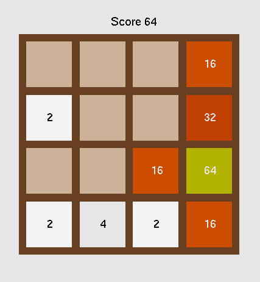

# 2048
### 2048 game with c++ and OpenGL




# Install dependencies
```bash
$ sudo apt-get install libglfw3-dev
$ sudo apt-get install libglew-dev
$ sudo apt-get install freeglut3-dev
$ sudo apt-get install libtbb-dev
$ sudo apt-get install libeigen3-dev
```

# Clone the package 
```bash
$ cd ~/catkin_ws/src
$ git clone https://github.com/jaeyoungjo99/2048.git
```

# Build the package
```bash
$ cd ~/catkin_ws
$ catkin_make
```

# Run the package
```bash
$ source devel/setup.bash
$ roslaunch game_2048 game_2048.launch
